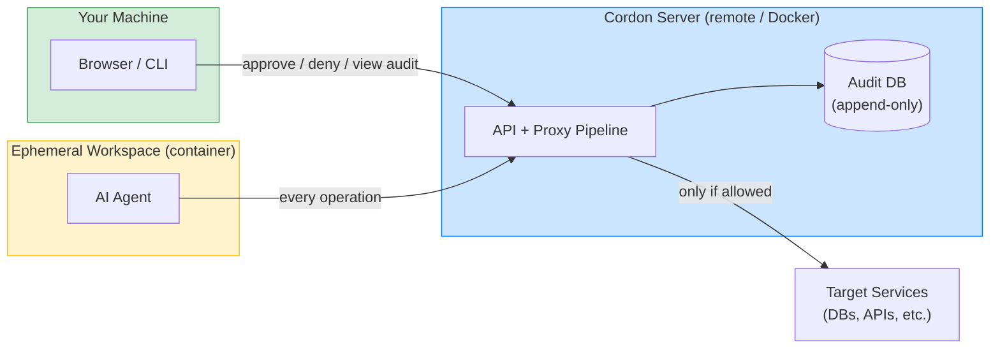
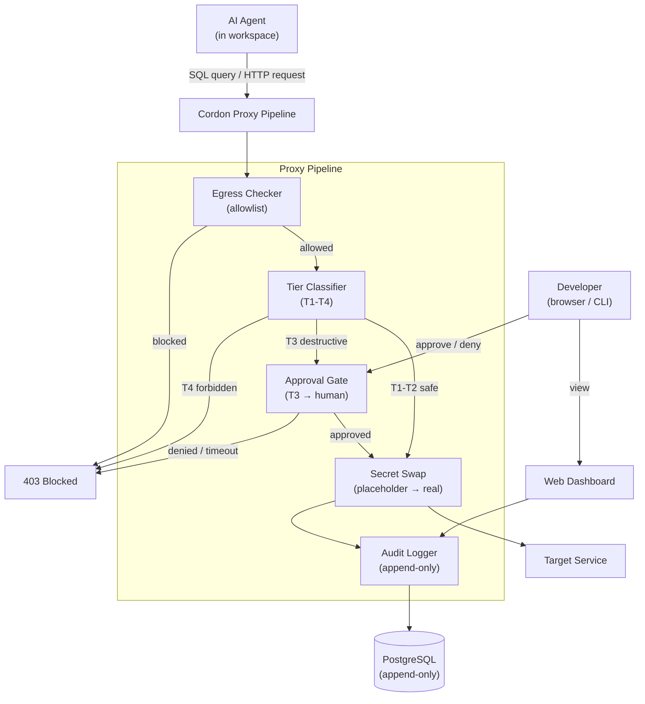
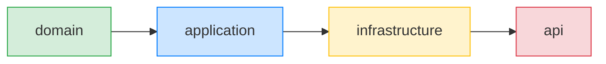

<p align="center">
  
</p>

<h1 align="center">Cordon</h1>

AI coding agents are powerful, but running them on your machine means giving them access to your filesystem, credentials, databases, and network. One bad tool call and an agent can `DROP TABLE production`, exfiltrate your `.env`, or `curl` your secrets to an external server.

**Cordon moves agent execution off your machine entirely.** Agents run in isolated, ephemeral workspaces where every operation passes through a proxy that classifies, audits, and gates it — before it reaches anything real.

## Why Zero-Trust

Traditional sandboxing (containers, VMs) controls _where_ code runs but not _what it does once running_. An agent inside a container with database credentials can still `DROP TABLE` or `SELECT *` your entire dataset.

Cordon applies zero-trust principles at the **operation level**:

- **No implicit access.** Every SQL query, HTTP request, and shell command is intercepted and classified before execution.
- **No credential exposure.** Agents work with placeholder tokens (`cordon-placeholder-api-key`). Real credentials are injected at the proxy layer and never enter the workspace.
- **No unrestricted egress.** Agents can only reach hosts on an explicit allowlist. Everything else is blocked.
- **No silent destruction.** Destructive operations (DELETE, DROP TABLE) require explicit human approval via the dashboard or CLI.
- **Full audit trail.** Every operation is logged to an append-only store — what was attempted, what tier it was classified as, whether it was allowed or blocked, and how long it took.

## What Runs Where



| Component                 | Runs on               | Has access to                                                             |
| ------------------------- | --------------------- | ------------------------------------------------------------------------- |
| **Your browser / CLI**    | Your machine          | Dashboard, approval prompts — no credentials, no agent code               |
| **Cordon server + proxy** | Remote host or Docker | Real credentials (for swap), audit DB, tier rules                         |
| **AI agent workspace**    | Ephemeral container   | Only placeholder tokens, allowlisted egress, no filesystem access to host |

Nothing the agent does can reach your machine. Your machine only talks to the Cordon API to view audit logs and approve/deny operations.

## Proxy Pipeline



## Operation Tiers

| Tier | Policy           | Examples                                           |
| ---- | ---------------- | -------------------------------------------------- |
| 1    | Allow + log      | SELECT (with WHERE/LIMIT), HTTP GET, EXPLAIN, SHOW |
| 2    | Allow + log      | INSERT, HTTP POST/PUT/PATCH                        |
| 3    | Require approval | UPDATE, DELETE, DROP TABLE, unbounded SELECT       |
| 4    | Always block     | DROP DATABASE, TRUNCATE, GRANT, REVOKE             |

## Quick Start

```bash
make install-tools                # one-time: install air (Go hot reload) + npm deps
make dev                          # start everything: postgres + Go (hot reload) + Vite (HMR)
```

Opens at http://localhost:5173 (frontend) proxying to http://localhost:8443 (API).

```bash
# Tier 1 — allowed
curl -s -X POST http://localhost:8443/api/proxy/sql \
  -H 'Content-Type: application/json' \
  -d '{"query":"SELECT * FROM users WHERE id = 1","caller":"my-agent"}'

# Tier 4 — blocked
curl -s -X POST http://localhost:8443/api/proxy/sql \
  -H 'Content-Type: application/json' \
  -d '{"query":"TRUNCATE TABLE users","caller":"my-agent"}'

# Egress — denied
curl -s -X POST http://localhost:8443/api/proxy/http \
  -H 'Content-Type: application/json' \
  -d '{"method":"POST","host":"evil-exfil.com","url":"/steal","caller":"agent"}'

# Audit log
curl -s http://localhost:8443/api/audit | jq .
```

## CLI

```bash
go install ./cmd/cordon

cordon status                     # Health check
cordon proxy sql "SELECT 1"       # SQL proxy
cordon proxy http GET github.com  # HTTP proxy
cordon audit show                 # Audit log (table or --json)
cordon workspace create myws      # Create workspace
cordon workspace list             # List workspaces
cordon connect <workspace-id>     # Terminal relay
```

## Project Structure

```
cmd/
  server/              API server entry point
  cordon/              CLI entry point
internal/
  domain/              Pure types (Tier, AuditEntry, Workspace, etc.)
  application/
    ports/             Interfaces (TierClassifier, AuditStore, SecretVault)
    proxy/             Pipeline: classify → egress → swap → audit
    audit/             Audit query service
  infrastructure/
    postgres/          Audit store + testcontainers integration tests
    docker/            Workspace orchestrator (devcontainer CLI)
    sops/              Secret vault (in-memory, SOPS planned)
    websocket/         Approval store with channel-based blocking
    config/            .cordon.yaml parser
  api/
    handlers/          HTTP handlers
    middleware/        Auth + RFC 7807 error handling
    ws/                WebSocket (terminal relay, audit feed, approvals)
web/                   SvelteKit frontend (Svelte 5, Tailwind v4, adapter-static)
archtest/              AST-based architecture constraint tests
e2e/                   End-to-end tests
migrations/            PostgreSQL migrations
docs/                  Spec, acceptance tests, UI audit screenshots
```

Architecture layer dependencies enforced by `archtest/layers_test.go`:



Each layer may only depend on layers to its **left**. Violations fail the build.

## Make Targets

```
make dev                Full dev stack (postgres + Go hot reload + Vite HMR)
make dev-db             Start only postgres + run migrations
make dev-server         Go server with hot reload (assumes postgres)
make dev-web            Vite dev server with HMR
make stop               Stop all services

make build              Build Go binaries
make build-web          Build frontend for production
make build-docker       Build Docker image

make test               Unit + arch tests (Go + frontend types)
make test-go            Go tests only
make test-integration   Integration tests (testcontainers)
make test-e2e           Full E2E (spins up docker compose, runs tests, tears down)
make check              Frontend type checking

make clean              Remove build artifacts
make install-tools      Install air + npm deps
make migrate            Run database migrations
```

## Security Model — Defense in Depth

The threat model assumes **anything running inside a workspace is potentially malicious**. An AI agent (or any code it executes) may attempt to exfiltrate secrets, access unauthorized services, destroy data, or escape the container. Cordon defends against this with seven layers, each independent — compromising one layer should not defeat the others.

### Layer 1: Network Isolation

Workspace containers run on Docker internal networks with **no route to the outside world**. The only path out is through a per-workspace gateway container that forwards traffic exclusively to the Cordon proxy. Containers lack `CAP_NET_ADMIN` and cannot modify routing.

**Current gaps:** DNS queries are not filtered (resolved by Docker daemon, not Cordon). Egress can be disabled entirely via `CORDON_EGRESS_ENFORCE=false` for development.

### Layer 2: Egress Allowlist

Even traffic that reaches the proxy is checked against a host allowlist. Only explicitly permitted hosts (e.g., `github.com`, `registry.npmjs.org`) are reachable. Everything else returns 403.

**Current gaps:** The allowlist is global (not per-workspace or per-tenant) and hardcoded — changing it requires a code change and redeploy. No per-workspace egress policies exist yet.

### Layer 3: Operation Classification (Tier System)

Every SQL query and HTTP request is classified into tiers (T1–T4) before execution. Classification determines whether the operation proceeds, requires approval, or is blocked outright.

**Current gaps:** SQL classification is keyword-based, not parse-based. It can't detect unbounded result sets disguised with high LIMIT values, SQL injection in agent-constructed queries, or data exfiltration via benign-looking SELECTs. MCP tool calls bypass the pipeline entirely (see OPEN-ISSUES.md).

### Layer 4: Approval Gates

Tier 3 operations (DELETE, DROP TABLE, unbounded SELECT) block until a human approves or denies via the dashboard or CLI. Approvals can be scoped (one-time, session, or pattern-based) and have a 5-minute timeout.

**Current gaps:** Approval grants are stored in memory and lost on server restart. The approval decision itself is not persisted to the audit trail (only the operation outcome is).

### Layer 5: Secret Isolation

Containers never see real credentials. The workspace receives placeholder tokens (`cordon-placeholder-database-url`). Real values are injected at the proxy layer during secret swap — after classification and approval, immediately before the request is forwarded upstream. Real values never appear in audit logs, API responses, or container environment variables.

**Current gaps:** The vault is in-memory only (loaded from env vars at startup, lost on restart, no encryption at rest). The `sanitizeEnv()` function catches known secrets during container creation, but unregistered secrets in devcontainer.json would leak. Secret swap is text-based string replacement, not cryptographic — predictable placeholder formats could theoretically be exploited.

### Layer 6: Audit Trail

Every operation through the proxy pipeline is logged to an append-only PostgreSQL store: what was attempted, the tier classification, the decision (allowed/blocked/denied), duration, and redacted details. Real-time streaming to the dashboard via WebSocket.

**Current gaps:** Audit writes are best-effort (`_ = audit.Write(...)`) — failures are silently dropped, not queued or retried. Workspace lifecycle events (create, destroy, suspend) are logged to stdout but not the audit store. Terminal sessions and container-internal commands are not audited. Response data (row counts, result sizes) is not captured.

### Layer 7: Container Hardening

Containers run unprivileged with CPU and memory limits. They are ephemeral by design — destroyed after use with no persistent state. The Docker socket is never mounted.

**Current gaps:** No explicit capability dropping (default Docker caps include `CAP_NET_RAW`, `CAP_SYS_PTRACE`). No seccomp profile. No AppArmor/SELinux policies. No image vulnerability scanning. Full read-write filesystem access within the container.

### Cross-Cutting: Tenant Isolation

All state (workspaces, secrets, audit entries, approvals) is scoped by tenant ID. No cross-tenant data access is possible through the API.

**Current gaps:** Authentication is not implemented — static tenant ID in dev mode means anyone who can reach port 8443 operates as the default tenant. Real OIDC/Entra ID integration is deferred.

### Layer Maturity Summary

| Layer               | Status      | Production-Ready                    |
| ------------------- | ----------- | ----------------------------------- |
| Network Isolation   | Implemented | Yes (Docker)                        |
| Egress Allowlist    | Implemented | Partial — needs per-workspace rules |
| Tier Classification | Implemented | Partial — keyword-only SQL          |
| Approval Gates      | Implemented | Partial — in-memory grants          |
| Secret Isolation    | Implemented | No — needs real vault backend       |
| Audit Trail         | Implemented | Partial — best-effort writes        |
| Container Hardening | Basic       | No — needs seccomp/AppArmor         |
| Tenant Isolation    | Designed    | No — needs real auth                |

## Design Decisions

| Decision       | Choice                  | Rationale                                                  |
| -------------- | ----------------------- | ---------------------------------------------------------- |
| DB access (v1) | HTTP-only (`POST /sql`) | Postgres wire protocol can't be intercepted by HTTP proxy  |
| SQL parser     | Keyword-based           | Simple, sufficient for v1, upgradeable to vitess/sqlparser |
| Auth (v1)      | Static tenant ID        | Single-user dev; Ory Kratos integration planned            |
| Approval store | In-memory + channels    | Decisions are ephemeral; persistence not needed for v1     |
| Frontend       | SvelteKit SPA           | adapter-static, Vite proxy to Go backend                   |

## License

MIT
